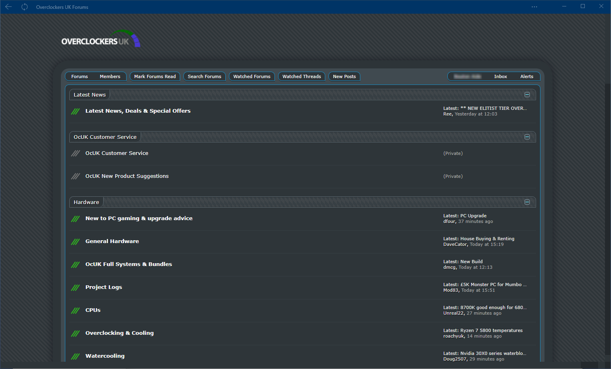

<h1 align="center">
	Xen Minimal Curvy Neon OcUK Theme
</h1>

<p align="center">
	<strong>
		<a href="https://www.overclockers.co.uk/forums/">Forum Website</a>
		•
		<a href="https://www.overclockers.co.uk/forums/threads/the-ocuk-new-stylish-themes-thread-2017.18769736/">Thread Discussion</a>
	</strong>
</p>

<p align="center">
	
</p>

## Description

Donate to support updates

If you use and like feel free to buy me a coffee, paypal: rail.monkey@ntlworld.com

<b>Author</b> - Sean Mayes<br />
<b>Date Created</b> - June 17, 2019<br/>
<b>Applies To</b> - overclockers

## Issues
If you have any problems with this theme please report an issue in the github issue section for this theme.<br/>
https://github.com/el-profesor926/OcUK-Theme-Xen-Minimal-Curvy-Neon/issues 

## Installation

install notes coming soon:

```install notes coming soon!
```
